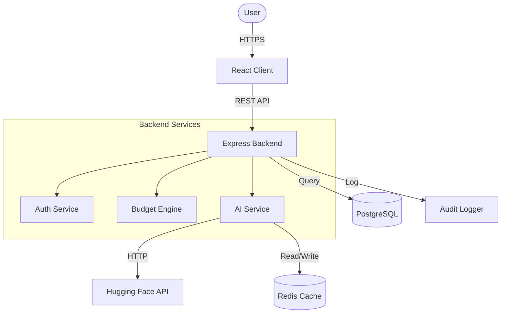

# 🎓 UniFlow - Student Finance Dashboard

> **AI-powered personal finance management designed specifically for college students**

[](https://github.com/amar-295/student-finance-db/actions)
[](https://github.com/amar-295/student-finance-db)
[](https://github.com/amar-295/student-finance-db)
[](LICENSE)

**Live Demo:** [Coming Soon] | **Docs:** [API Documentation](./docs/)

---

## ✨ What Makes UniFlow Special

- 🤖 **AI-Powered Categorization** - Automatic transaction categorization using Hugging Face
- 💰 **Smart Budgeting** - Real-time budget tracking with AI recommendations
- 👥 **Bill Splitting** - Easy expense sharing with roommates
- 📊 **Insights Dashboard** - AI-generated spending insights
- 🔒 **Bank-Grade Security** - JWT auth, bcrypt hashing, rate limiting

---

## 🚀 Quick Start

### Prerequisites
- Node.js 20+
- PostgreSQL 15+
- Redis (for caching)

### Installation

```bash
# 1. Clone repository
git clone https://github.com/amar-295/student-finance-db.git
cd student-finance-db

# 2. Install backend dependencies
cd backend
npm install

# 3. Set up environment
cp .env.example .env
# Edit .env with your credentials

# 4. Initialize database
npm run prisma:generate
npm run prisma:migrate
npm run prisma:seed  # Optional: sample data

# 5. Start backend
npm run dev

# 6. In new terminal, start frontend
cd ../frontend
npm install
npm run dev
```

Visit **http://localhost:5173** and login with `alex@demo.com` / `DemoPassword123`.

---

## 🎯 Current Status (80% MVP Complete)

### ✅ **Fully Implemented & Tested**
- **Authentication**: Register, login, password reset (100%)
- **Accounts**: CRUD for checking/savings/cash (100%)
- **Transactions**: AI categorization, search & filters (100%)
- **Infrastructure**: Docker, CI/CD, 68 Integration Tests (100%)

### 🚧 **In Progress**
- **Budgets**: Backend Ready, Frontend UI Next Priority
- **Bill Splitting**: Backend Ready, Frontend UI Planned
- **Analytics**: Partial Backend, Frontend UI Planned

---

## 🛠 Tech Stack

| Layer | Technology | Why we chose it |
| :--- | :--- | :--- |
| **Frontend** | React 19 + Vite 7 | Blazing fast SPA with the latest React hooks. |
| **Styling** | Tailwind CSS 3 | Modern, utility-first design system. |
| **Backend** | Express + Node.js | Robust REST API architecture. |
| **Database** | PostgreSQL + Prisma | Type-safe ORM with powerful schema management. |
| **AI / ML** | Hugging Face API | Serverless NLP for zero-shot text classification. |
| **Cache** | Redis | High-speed cache for API responses and rate limits. |

---

## 🏗 High-Level Architecture



---

## 🔐 API Endpoints

### Authentication
```
POST   /api/auth/register          # Create account
POST   /api/auth/login             # Get JWT tokens
```

### Transactions (AI-Powered 🤖)
```
POST   /api/transactions           # Create (auto-categorizes with AI)
GET    /api/transactions           # List with filters
GET    /api/transactions/search    # Search by merchant
```

**[Full API Documentation](./backend/README.md)**

---

## 🧪 Testing

```bash
# Run backend tests (68 integration tests)
cd backend
npm test
```

**Current Test Results:**
```
✅ Authentication Tests:  15/15 passing
✅ Account Tests:         12/12 passing
✅ Transaction Tests:     18/18 passing
✅ Budget Tests:          14/14 passing
✅ Password Reset Tests:   9/9 passing
━━━━━━━━━━━━━━━━━━━━━━━━━━━━━━━━━━━━━━
✅ TOTAL:                 68/68 passing
```

---

## 🔒 Security Features (Enterprise Grade)
- ✅ JWT authentication with refresh tokens
- ✅ Password hashing (bcrypt, 10 rounds)
- ✅ Rate limiting (100 req/15min)
- ✅ SQL injection protection (Prisma ORM)
- ✅ IDOR protection middleware

---

## 📄 License
This project is licensed under the MIT License - see [LICENSE](LICENSE) file for details.

---

<p align="center">
  Built with ❤️ by Amarnath Sharma
</p>
