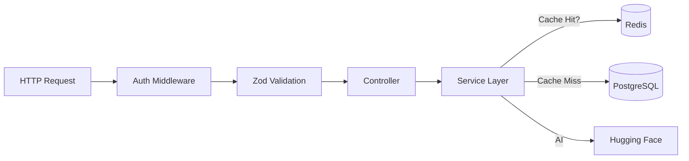

# 🛠️ UniFlow Backend Architecture

This directory contains the robust Node.js/Express API that powers UniFlow. It is built with scalability, type safety, and maintainability in constant focus.

## 🏗️ Architectural Pattern

We follow a strict **Controller-Service-Repository** separation of concerns.



## 📂 Deep Codebase Structure

```
backend/
├── prisma/                 # 💾 Database Layer
│   ├── schema.prisma       # Single source of truth for DB
│   └── seed.ts             # Demo data population
│
├── src/
│   ├── config/             # ⚙️ Configuration
│   │   ├── env.ts          # Zod-validated environment vars
│   │   └── redis.ts        # Redis connection setup
│   │
│   ├── controllers/        # 🔌 Traffic Controllers (Req/Res)
│   │   ├── account.controller.ts
│   │   ├── ai.controller.ts
│   │   ├── auth.controller.ts
│   │   ├── budget.controller.ts
│   │   └── transaction.controller.ts
│   │
│   ├── middleware/         # 🛡️ Request Guardrails
│   │   ├── auth.middleware.ts
│   │   ├── error.middleware.ts
│   │   └── rate-limit.middleware.ts
│   │
│   ├── routes/             # 🚦 API Route Definitions
│   │   ├── auth.routes.ts
│   │   └── transactions.routes.ts
│   │
│   ├── services/           # 🧠 Business Logic (The Core)
│   │   ├── ai-categorization.service.ts  # Redis + HuggingFace
│   │   ├── auth.service.ts               # JWT & Password Hash
│   │   ├── budget.service.ts             # Limits & Alerts
│   │   └── transaction.service.ts        # Filters & Search
│   │
│   ├── utils/              # 🧰 Helpers
│   │   ├── AppError.ts     # Standardized Error Class
│   │   └── logger.ts       # Pino JSON Logger
│   │
│   ├── app.ts              # Express App Setup
│   └── server.ts           # Server Entry Point
```

---

## 🧠 AI Categorization Engine

The crown jewel of our backend is the `AICategorizationService`. It uses a multi-tiered strategy to categorize transactions:

1.  **Cache Layer (Redis)**:
    *   We generate a normalized key from the merchant name (e.g., "STARBUCKS #124" -> `cat:starbucks`).
    *   If found in Redis (24h TTL), return immediately (Sub-millisecond latency).

2.  **AI Layer (Hugging Face)**:
    *   If not cached, we call the `facebook/bart-large-mnli` Zero-Shot Classification model.
    *   We consider the confidence score. If > 80%, we accept it and cache the result.

3.  **Heuristic Layer (Regex)**:
    *   If the AI is down, slow, or low confidence, we fall back to a robust Regex map in `src/utils/category-rules.ts`.
    *   Example: `/uber|lyft/i` -> `Transportation`.

4.  **Default**:
    *   If all else fails, category defaults to `Uncategorized` for manual user review.

---

## 💾 Database Schema (Prisma)

Our PostgreSQL database is normalized to 3NF. Key relationships:

*   **User** 1:N **Account** (One user has many bank accounts)
*   **Account** 1:N **Transaction** (Transactions belong to an account)
*   **User** 1:N **Budget** (Budgets are personal to a user)
*   **Budget** 1:1 **Category** (Each budget tracks one specific category)

> See `prisma/schema.prisma` for the exact DDL and type definitions.

---

## 🔒 Security & Performance Features

*   **Rate Limiting**: `express-rate-limit` backed by Redis prevents abuse.
    *   *Default*: 100 requests per 15 mins per IP.
*   **Helmet**: Sets secure HTTP headers (HSTS, X-Frame-Options, etc.).
*   **Compression**: Gzip compression enabled for all JSON responses > 1kb.
*   **Logging**: `pino-http` provides high-performance structured JSON logging for observability.

---

## 🧪 Running Tests

We use **Jest** with `supertest` for integration testing.

```bash
# Run all tests
npm test

# Run only AI service tests
npm test -- services/ai
```

> **Note**: Tests require a running Database instance (Docker or Local). They will create/destroy temporary data.
