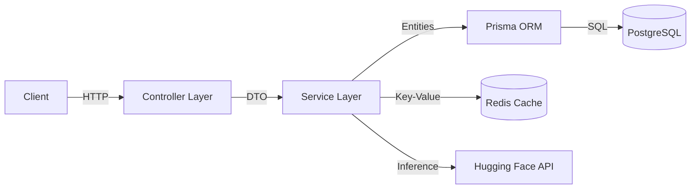

# UniFlow Backend API

Production-grade REST API service powered by **Node.js**, **Express**, **TypeScript**, and **AI**.

---

## 📖 Overview

The UniFlow Backend acts as the central nervous system for the platform. It handles all business logic, data persistence, and third-party integrations (Hugging Face AI, Redis).

### Key Responsibilities
-   **Identity Management**: Secure JWT-based authentication with refresh tokens.
-   **Transaction Processing**: CRUD operations for financial records.
-   **AI Categorization**: Zero-shot classification of merchant names into standardized categories.
-   **Budget Engine**: Real-time spending analysis and alert generation.
-   **Data Integrity**: ACID-compliant transactions via Prisma & PostgreSQL.
-   **Performance**: Redis caching for AI results and rate limiting.

---

## 🏗 Architecture

We utilize a **Service-Repository** pattern to ensure separation of concerns and testability.



### Layer Breakdown
1.  **Controllers**: Handle HTTP requests, input validation (Zod), and response formatting.
2.  **Services**: Contain core business logic (e.g., "calculate monthly budget status").
3.  **Middleware**: Global error handling, rate limiting, and auth verification.
4.  **Utils**: Shared helpers for date manipulation, math, etc.

---

## 🛠 Tech Stack

| Component | Technology | Version |
| :--- | :--- | :--- |
| **Runtime** | Node.js | v20+ |
| **Framework** | Express.js | 4.x |
| **Language** | TypeScript | 5.x |
| **Database** | PostgreSQL | 15+ |
| **ORM** | Prisma | 5.x |
| **Caching** | Redis | 7.x |
| **Validation** | Zod | 3.x |
| **Logging** | Pino | 9.x |
| **Testing** | Jest | 29.x |

---

## 🔧 Environment Variables

The application requires the following environment variables.
Copy `.env.example` to `.env` to get started.

| Variable | Description | Required | Default |
| :--- | :--- | :--- | :--- |
| `PORT` | API Port | No | `5000` |
| `DATABASE_URL` | PostgreSQL Connection String | **Yes** | - |
| `REDIS_URL` | Redis Connection String | No | `redis://localhost:6379` |
| `JWT_SECRET` | Secret for Access Tokens | **Yes** | - |
| `JWT_REFRESH_SECRET` | Secret for Refresh Tokens | **Yes** | - |
| `JWT_EXPIRES_IN` | Access Token TTL | No | `15m` |
| `JWT_REFRESH_EXPIRES_IN` | Refresh Token TTL | No | `7d` |
| `HUGGING_FACE_API_KEY` | For AI Categorization | No* | - |
| `FRONTEND_URL` | CORS Origin URL | No | `http://localhost:3000` |

> *Note: If `HUGGING_FACE_API_KEY` is omitted, the system falls back to regex-based categorization rules.*

---

## 🏃 Local Development

### Option A: Docker (Recommended)
Spin up the database and Redis without installing them locally.

```bash
# From project root
docker-compose up -d db redis
```

### Option B: Manual Setup
Ensure PostgreSQL and Redis are running locally. Update `.env` with your local credentials.

### Starting the Server

```bash
# 1. Install dependencies
npm install

# 2. Run Database Migrations
npx prisma migrate dev

# 3. Seed Database (Optional)
npx tsx prisma/seed.ts

# 4. Start Development Server
npm run dev
```

The API will be available at `http://localhost:5000`.

---

## 💾 Database & Prisma

We use **Prisma** as our ORM. The schema is located at `prisma/schema.prisma`.

### Common Commands

| Command | Description |
| :--- | :--- |
| `npx prisma generate` | Regenerate TypeScript types based on schema. |
| `npx prisma migrate dev` | Create and apply a new migration. |
| `npx prisma studio` | Open the database GUI in browser. |
| `npx prisma db push` | Push schema changes without tracking migrations (prototyping). |

---

## 🔌 API Endpoints

Full Swagger documentation (if available) would be at `/api-docs`.

### 🔐 Authentication
-   `POST /api/auth/register` - Create new account.
-   `POST /api/auth/login` - Authenticate and receive tokens.
-   `POST /api/auth/refresh` - Refresh access token.
-   `POST /api/auth/logout` - Invalidate tokens.

### 💸 Transactions
-   `GET /api/transactions` - List transactions (pagination + filters).
-   `POST /api/transactions` - Create transaction (triggers AI auto-categorization).
-   `GET /api/transactions/summary` - Get spending statistics.

### 💰 Budgets
-   `GET /api/budgets` - View all active budgets.
-   `GET /api/budgets/status` - Check health (Safe/Warning/Exceeded).
-   `POST /api/budgets/recommend` - Generate AI-based budget limits.

---

## 🤖 AI Categorization

The backend utilizes **Hugging Face's Zero-Shot Classification** (`facebook/bart-large-mnli`) to categorize transactions meaningfuly.

**Workflow:**
1.  User enters: "Payment to STARBUCKS COFFEE #492"
2.  Backend checks **Redis Cache** for exact match.
3.  If miss, sends text to **Hugging Face Inference API**.
4.  AI determines standard category: `Food & Dining`.
5.  Result is cached in Redis for 24 hours (TTL).
6.  Transaction is saved with the correct category.

**Fallback Mechanism:**
If the AI service is down or API key is missing, a **Regex Engine** (`src/services/ai-categorization.service.ts`) takes over to match common patterns locally.

---

## 🛡 Security & Logging

-   **Rate Limiting**: `express-rate-limit` + `RedisStore` prevents brute force.
-   **Audit Logging**: Critical actions (Login, Payment, Delete) are logged to the `AuditLog` table asynchronously to avoid blocking the main thread.
-   **Error Handling**: Centralized `AppError` class ensures consistent JSON error responses.

---

## 📈 Future Improvements

-   [ ] **Queue System**: Move email notifications (BullMQ) to background workers.
-   [ ] **WebSockets**: Real-time updates for shared bill splits.
-   [ ] **API Versioning**: Introduce `/api/v2` namespace.

---
