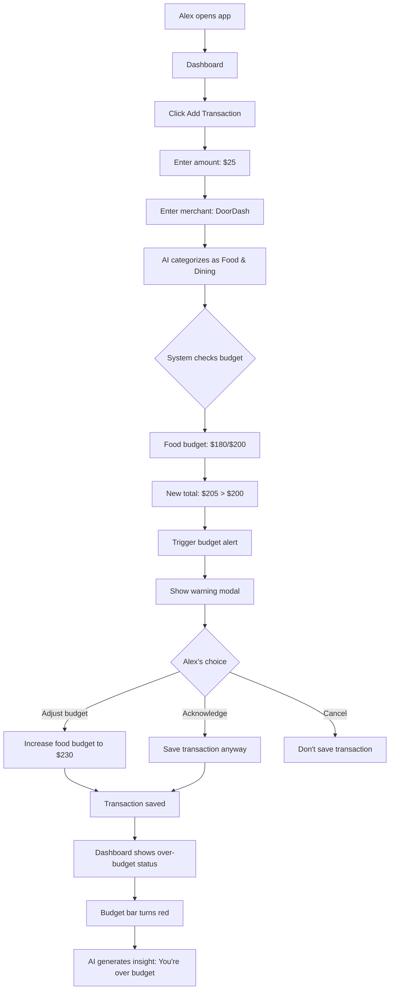
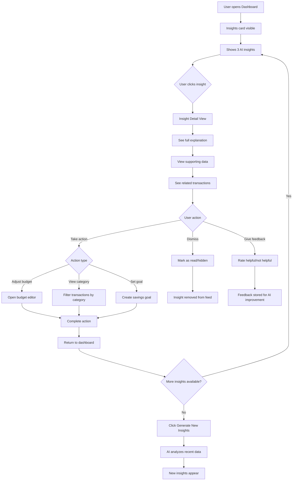
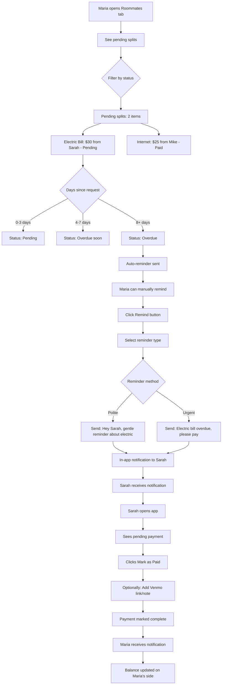
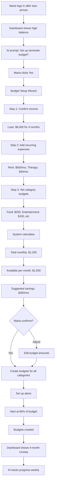

# Complete User Flows - Student Finance Dashboard

## Flow B: Budget Alert Scenario (Alex)

**Scenario:** Alex has a $200 food budget, has spent $180, and adds a $25 DoorDash order that triggers an alert.



**Key UI Elements:**
- Alert modal with clear messaging: "This transaction will put you $5 over your Food budget"
- Options: "Adjust Budget" | "Add Anyway" | "Cancel"
- Budget bar visual update (green → yellow → red)
- Contextual AI insight generated

---

## Flow C: Viewing AI Insights (All Users)

**Scenario:** User navigates to dashboard to view and interact with AI-generated financial insights.



**AI Insight Types (from personas):**

1. **Warning Insights** (Red)
   - "You're spending 40% more on food delivery this week"
   - "You'll run out of money by week 3 at this rate"
   - "Transportation spending doubled this month"

2. **Positive Insights** (Green)
   - "Great job! You're $55 under budget for entertainment"
   - "You saved $120 more than last month"
   - "Your grocery spending decreased by 15%"

3. **Tip Insights** (Blue)
   - "Your coffee habit costs $120/month. Campus coffee saves $70"
   - "Cooking 2x/week could save $80/month vs delivery"
   - "You could save $30/mo by switching to student subscriptions"

---

## Flow D: Roommate Payment Collection (Maria's Pain Point)

**Scenario:** Maria needs to follow up on unpaid bills from roommates.



**Smart Features:**
- Auto-reminders after 7 days
- Escalating message tone (polite → firm)
- Venmo/Zelle deep links (pre-filled amount)
- Payment deadline tracking

---

## Flow E: First-Time Budget Setup (Semester Smoothing for Maria)

**Scenario:** Maria gets $6,000 loan disbursement and wants to spread it across 4 months.



---

## Flow F: Multi-Currency Transaction (Yuki)

**Scenario:** Yuki receives ¥200,000 from parents and wants to track it properly.

```mermaid
graph TD
    A[Yuki opens app] --> B[Set base currency: USD]
    B --> C[Add Transaction: Income]
    C --> D[Enter amount: 200000]
    D --> E[Select currency: JPY]
    E --> F[System fetches exchange rate]
    F --> G[Shows converted: ~$1,350 USD]
    G --> H[Option to lock rate or use live]
    
    H --> I{Yuki's choice}
    I -->|Lock rate| J[Save as: ¥200,000 = $1,350]
    I -->|Live rate| K[Update conversion daily]
    
    J --> L[Transaction saved]
    K --> L
    L --> M[Dashboard shows both amounts]
    M --> N[¥200,000 ($1,350 USD)]
    
    N --> O[Monthly report generated]
    O --> P[Export in JPY for parents]
    P --> Q[Export in USD for Yuki's tracking]
```

**Multi-Currency Features:**
- Display both original and converted amounts
- Lock exchange rate at transaction time
- Monthly reports in both currencies
- Total balance in base currency + breakdown by currency

---

## Summary of All Core Flows

| Flow | Persona | Purpose | Complexity |
|------|---------|---------|-----------|
| A - Bill Splitting | Maria | Split shared expenses | Medium |
| B - Budget Alert | Alex | Prevent overspending | Medium |
| C - AI Insights | All | Financial awareness | High (AI) |
| D - Payment Collection | Maria | Collect debts | Medium |
| E - Semester Budget | Maria | Plan loan spending | High |
| F - Multi-Currency | Yuki | Track foreign income | Medium |

---

## Navigation Flow (Quick Reference)

```
Landing → Sign Up → Onboarding → Dashboard
                                    ↓
                    ┌───────────────┼───────────────┐
                    ↓               ↓               ↓
              Transactions      Budgets       Roommates
                    ↓               ↓               ↓
              [Add/Edit]     [Create/Edit]   [Split/Track]
                    ↓               ↓               ↓
                    └───────────────┼───────────────┘
                                    ↓
                              AI Insights
                                    ↓
                              [View/Act]
```

---

## Mobile Considerations

**Key mobile-specific flows:**
1. **Pull-to-refresh** on all list views
2. **Swipe actions** on transactions (edit/delete)
3. **Bottom sheet modals** for add transaction (easier thumb reach)
4. **Quick add** from home screen widget
5. **Notifications** for:
   - Budget alerts
   - Payment received
   - Payment requests
   - New AI insights

---

## State Management Notes

**Global state needed:**
- User auth status
- Current account balance
- Active filters (transactions, budgets)
- Pending notifications count
- Currency settings

**Component-level state:**
- Form inputs (add transaction, split bill)
- Modal open/closed
- List pagination
- Collapsed/expanded sections

---

*These flows are ready for wireframing and implementation. Each flow maps to specific API endpoints and database operations.*
