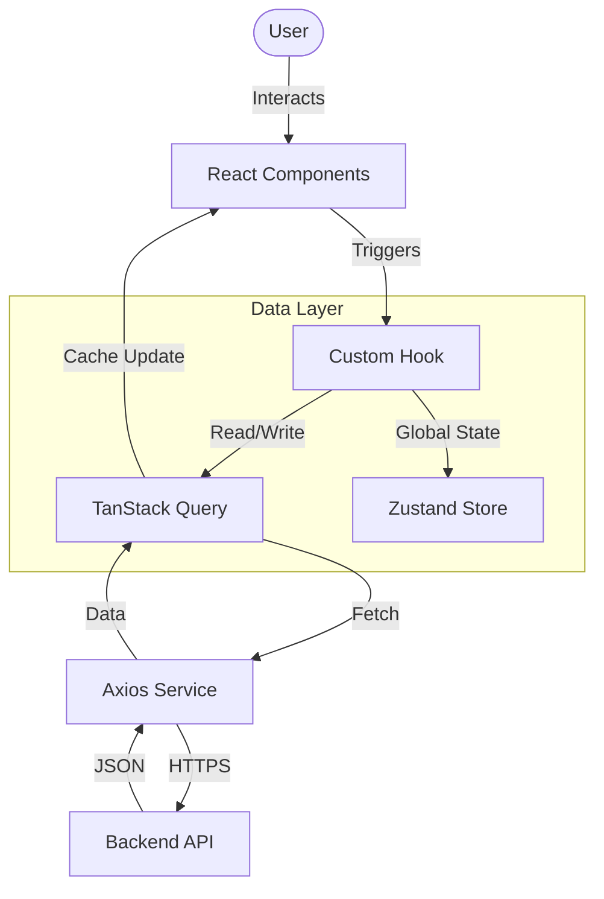

# 🎨 UniFlow Frontend Architecture

The frontend is a **Single Page Application (SPA)** built with **React 19** and **Vite**, focusing on performance, accessibility, and pixel-perfect design.

## 🌊 Frontend Data Flow

We use a layered architecture to separate UI from Data Logic.



1.  **UI Layer**: Components (e.g., `TransactionList`) only handle display and user events.
2.  **Logic Layer**: Custom hooks (e.g., `useTransactions`) abstract away the fetching logic.
3.  **Cache Layer**: `TanStack Query` manages loading states, caching, and background updates.
4.  **Service Layer**: `Axios` instances handle the raw HTTP communication (headers, auth tokens).

---

## 📂 Deep Codebase Structure

```
frontend/
├── src/
│   ├── assets/             # 🖼️ Static Images, Fonts
│   │
│   ├── components/         # 🧩 Reusable UI
│   │   ├── common/         # Buttons, Inputs, Cards
│   │   ├── layout/         # Sidebar, Header, Layout Wrappers
│   │   ├── transactions/   # Transaction-specific Widgets
│   │   └── styles/         # Shared tailwind classes
│   │
│   ├── features/           # 📦 Domain Modules
│   │   ├── auth/           # Login/Register Logic
│   │   ├── budgets/        # Budget Logic
│   │   └── transactions/   # Transaction Logic
│   │
│   ├── hooks/              # 🪝 Custom Hooks
│   │   ├── useAuth.ts
│   │   ├── useDebounce.ts
│   │   └── useTheme.ts
│   │
│   ├── pages/              # 📄 Route Views
│   │   ├── DashboardPage.tsx
│   │   ├── TransactionsPage.tsx
│   │   └── LoginPage.tsx
│   │
│   ├── services/           # 📡 API Connectors
│   │   ├── api.ts          # Axios Interceptors
│   │   ├── authService.ts
│   │   └── transactionService.ts
│   │
│   └── store/              # 🏪 Global State
│       └── useAuthStore.ts # User Session Store
```

---

## ⚡ State Management Strategy

We use a hybrid approach to state management for optimal performance:

1.  **Server State (**`@tanstack/react-query`**)**:
    *   Handles all async data (Transactions, User Profile).
    *   Provides automatic caching, background refetching (stale-while-revalidate), and optimistic updates.
    *   *Why?* Eliminates manual `useEffect` fetching and loading state boilerplate.

2.  **Client State (**`zustand`**)**:
    *   Handles global UI state that doesn't persist to the DB.
    *   Examples: `useAuthStore` (User session), `useSidebarStore` (Menu toggle).
    *   *Why?* Simpler and faster than Redux/Context API for global signals.

3.  **Form State (**`react-hook-form` + `zod`**)**:
    *   Manages uncontrolled form inputs and validation.
    *   *Why?* Renders only changed components (high performance) and shares validation logic with backend.

---

## 🎨 Design System & Styling

*   **Tailwind CSS 3.4**: Utility-first styling for rapid development.
*   **Radix UI / Headless UI**: Unstyled, accessible primitives for complex components (Dialogs, Dropdowns).
*   **Framer Motion**: Declarative animations for page transitions and micro-interactions.
*   **Responsive**: Mobile-first breakpoints (`sm`, `md`, `lg`, `xl`).

---

## 🧪 Testing (Vitest)

We use **Vitest** for unit and component testing. It shares the same Vite config, making it practically instant.

```bash
# Run tests
npm test

# Open UI Dashboard for tests
npm run test:ui
```

**Key Libraries:**
*   `@testing-library/react`: Tests components from user perspective.
*   `msw` (Mock Service Worker): Intercepts network requests to mock backend responses during tests.
